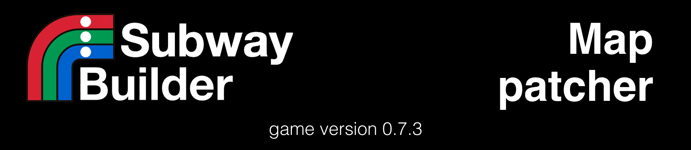

# 0.8.0 UPDATE IS ON THE WAY! The patcher currently works only on version 0.7.3.

# Subway-Builder-map-patcher
<div align="center">
  
</div>
<div align="center">
  <a href="[https://discord.gg/HNSdgEgzvg](https://discord.gg/HNSdgEgzvg)" target="_blank">
    
  </a>
</div>

## 🙏 Special thanks
Parts of different projects were used in this program.

https://github.com/piemadd/subwaybuilder-patcher
The original patcher that served as the foundation for all subsequent versions.

https://github.com/ngivan2004/subwaybuilder-patcher
Improved version with enhanced map loading and data processing capabilities.

https://github.com/Kronifer/subwaybuilder-patcher
Version adapted and fixed for Subway Builder 0.7.3 compatibility.

## 🔎 About
This node js application allows you to create custom maps for the game Subway Builder.

## ⚠️ Compatibility Notice

**Known Working Configuration:**
- ✅ **macOS** (fully tested)
- ✅ **Windows** (tested, but may be some problems)
- 🔄 **Linux** (untested - needs verification)

  If you successfully run this on Windows or Linux, please share your experience!

## 🚀 Planned Features

- **Better visual output** with progress indicators
- **Simplified configuration** setup process  
- **Custom city preview images** in the game menu
- **Tested support** for Windows and Linux
- **Custom insertion of cities** without basic one's from the game
- **Better demand calculation** for your maps

## 🛠️ Installation
If you need to use this patcher with an older version of the game, please check the [Releases page](https://github.com/bladistay/Subway-Builder-map-patcher/releases) for version-specific instructions and compatible patcher versions.

This installation guide is for the LATEST VERSION of both GAME and PATCHER that patcher supports:
1.  **Clone the repository:**
    ```bash
    git clone https://github.com/bladistay/Subway-Builder-map-patcher.git
    cd Subway-Builder-map-patcher
    ```
2.  **Install dependencies:**
    ```bash
    npm install
    ```

## 🕹️ Usage
**1. Replace your system values in config**

Locate the config.js file in the program folder and open it in any text editor.
Replace these values in the file:
```js
const config = {
    // Specify the path to Subway Builder game
    "location": "C://Users/YOUR_USER/AppData/Local/Programs/Subway Builder/Subway Builder.exe", // for Windows
    // "location": "/usr/bin/subway-builder",                          // for Linux
    // "location": "/Applications/Subway Builder.app",                 // for macOS
    
    // Specify your operating system
    "platform": "windows", // or "linux", or "macos"
```

**2. Add Cities to the config**

🎯 How to Find City Coordinates:

Open the website bboxfinder.com

Select the "Rectangle" tool in the top left corner

Draw around your city — simply create a rectangle around the city area

Copy the numbers next to the "Box" label at the bottom of the page

Coordinate example: ```-79.405575,43.641169,-79.363003,43.663029```

📝 Add a City to Configuration:
```js
"places": [
    {
        "code": "NYC",        // 3-letter code (e.g., main airport code)
        "name": "New York",   // City name
        "description": "The Big Apple", // Description
        "bbox": [-74.2591,40.4774,-73.7004,40.9176], // Coordinates
        "population": 8419000 // Population
    }
],
```
**3. Replace your tiles server values in config**

🆓 Option 1. MapTiler Cloud (Recommended)

Get your free API key at [Maptiler](https://cloud.maptiler.com/account/keys/).
```js
    //Change this value to api.maptiler.com if not
    "tileServerDomain": "api.maptiler.com",
    //Replace your own api key from maptiler instead of YOUR_MAPTILER_KEY
    "tileServerUrl": "https://api.maptiler.com/tiles/v3-openmaptiles/{z}/{x}/{y}.pbf?key=YOUR_MAPTILER_KEY"
};
```

🖥️ Option 2. Self-Hosted Tile Server
```js
    //Paste your own domain here to bypass the network block in the game (like this: stepan-skuratov.ru)
    "tileServerDomain": "localhost",
    //Paste your own domain here to get tiles from your server
    "tileServerUrl": "http://localhost:8080/data/v3/{z}/{x}/{y}.pbf"
};
```

**4. Run the processing scripts in terminal**
```bash
# Download map data
node scripts/download-maps.js

# Process the downloaded data
node scripts/process-data.js

# Patch the game files
node scripts/patch-game.js
```

**It is NORMAL that scripts don't output anything during execution** - this is expected behavior:

✅ No output = Everything is working correctly, wait till command prompt reappear and launch next script

❌ Only errors are displayed - if something goes wrong

⚠️ Some scripts may take several minutes with no visual feedback

**5. Enjoy the game**

Once all scripts finish successfully, check the build/ directory for your patched game files ready for distribution.
You also can see the unpacked version in the root of patcher.

## 🤔 FAQ

- **Discord Community**: Need real-time help or want to share your creations?  
  → Join the official Subway Builder Discord and write in the **#general-mods-discussion** channel
  
  <a href="https://discord.gg/HNSdgEgzvg" target="_blank">
    
  </a>


- **GitHub Issues**: Found a bug or have a feature request?  
  → Create an issue ticket on our GitHub repository

  <a href="https://github.com/bladistay/Subway-Builder-map-patcher/issues/new/choose" target="_blank">
    
  </a>
